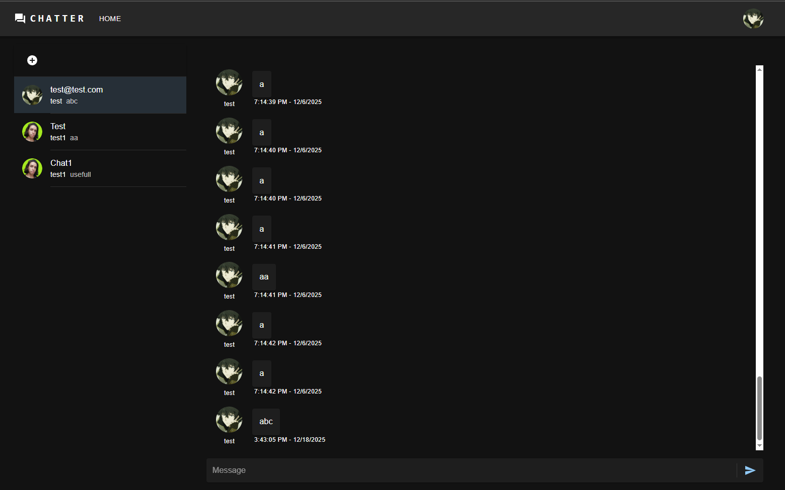

# 💻 Chatter Frontend

[](https://reactjs.org/)
[](https://www.apollographql.com/docs/react/)
[](https://mui.com/)
[](https://vitejs.dev/)
[](https://www.typescriptlang.org/)

## 🌟 Visão Geral

O frontend do Chatter é uma aplicação React de página única (SPA) de alta performance, desenvolvida para oferecer uma experiência de chat em tempo real fluida, com uma interface moderna e gerenciamento de estado robusto via GraphQL.

---

### 📸 Preview da Interface



---

## 🚀 Tecnologias Core

| Tecnologia          | Descrição                                                         |
| :------------------ | :---------------------------------------------------------------- |
| **React (Vite)**    | Biblioteca principal e build tool ultra-rápida.                   |
| **TypeScript**      | Tipagem estática para maior segurança e previsibilidade.          |
| **Apollo Client**   | Gerenciamento de Queries, Mutations e Subscriptions (WebSockets). |
| **Material UI**     | Framework de componentes para um design responsivo.               |
| **GraphQL CodeGen** | Geração automática de tipos baseada no Schema do backend.         |

---

## ⚙️ Como Rodar o Projeto

Siga os passos abaixo para configurar o ambiente de desenvolvimento local.

### **1. Pré-requisitos**

- **Backend**: O serviço de API deve estar em execução (padrão: `http://localhost:3333`).
- **Node.js**: Versão 18 ou superior instalada.

### **2. Instalação e Execução**

Para rodar o projeto, execute os seguintes comandos no seu terminal:

```bash
# Entre na pasta do frontend
cd chatter-frontend

# Instale as dependências do projeto
npm install

# Gere os tipos do GraphQL (Codegen)
# Fundamental para sincronizar as queries do frontend com o schema do backend
npm run codegen

# Inicie o servidor de desenvolvimento
npm run dev
```
